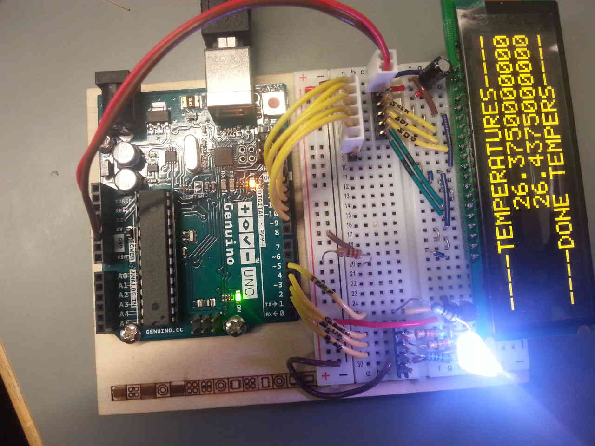

# Arduino test suite

Used to verify different parts of Toveri work as expected. Use this suite to close out malfunctioning parts.

## Installation

1. Install Arduino IDE
   http://www.arduino.org/downloads

2. Copy libraries to Arduino IDE libraries directory
   Change paths as needed.

    cp -r libraries/* ~/arduino-1.8.3/libraries/

3. Open Arduino IDE

4. Open ToveriTestBed.ino from Arduino IDE

5. Wire Arduino prototyping breadboard with Toveri components
   Use the KiCad schematics or try to follow these pictures.
   A readily assembled protoboard should be lying somewhere around.

6. Upload the program to Arduino.

7. Test each individual component.
   Simply replace working components with fresh components from the storage to test if they work properly.
   Test also the cables you make using this testbed.
   Arduino test bed is wired in such a way that it is compatible with the Toveri PCB.
   You can test the PCB by wiring cables from Arduino testbed to the PCB.

