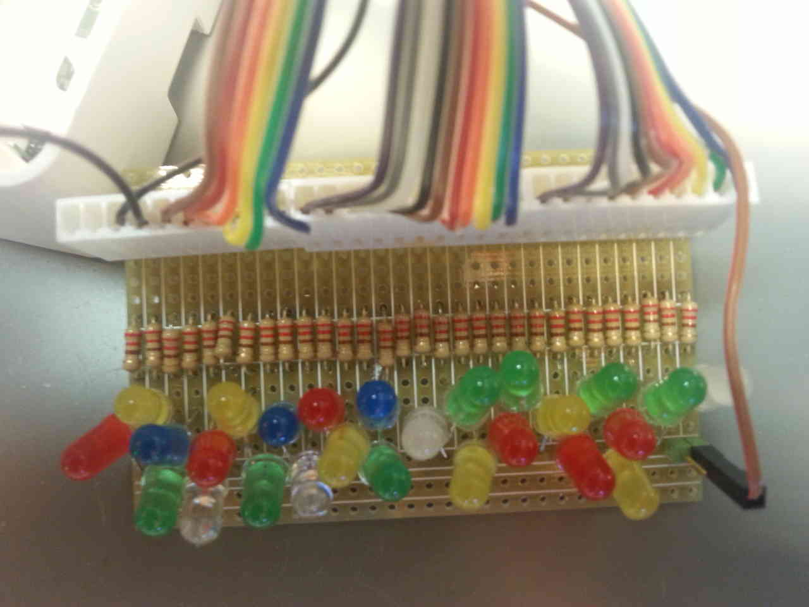

# Raspberry Pi GPIO test utility

Use this to verify that you have wiringPi and HiPi properly installed.
Raspberry hardware works as expected.

This should be done whenever an new Raspberry Pi is being deployed.

There propably are better and smarter tools for this, if so, pre-emptively order them beforehand.
This is what I made from the stuff I had in the timeframe I had.

## Dependencies

- http://wiringpi.com/download-and-install/
  You should do the git install for the latest version

- cpanm HiPi
  http://raspberrypi.znix.com/hipidocs/
  Note! as of writing, do not install using hipi-install as it installs a old and incompatible version.

## Building the hardware

You should have one of these lying around, but if you need to make one, here are example pictures of it.
Basically it is an array of components that gives some feedback which is easy to trace back to the individual
GPIO pin.

In this case I chose LEDs, which blink nicely and are easy to spot if one of these leds fails to blink.

See the images for inspiration:

See

    0-pins-to-test.cfg

for the physical Raspberry Pi pins you need to connect to the test board. Connect them in the order listed
in 0-pins-to-test.cfg

## Usage

Read "IN THIS FILE" and execute script:

    ./testGPIOPins.sh

## When led doesn't blink

It is possible for a LED to malfunction or the wiring/soldering to break. If you detect a possibly broken
GPIO pin, test the pin/cable/connectors using an external 3V3 power source if it actually works, or if the
problem is with the GPIO pin.

