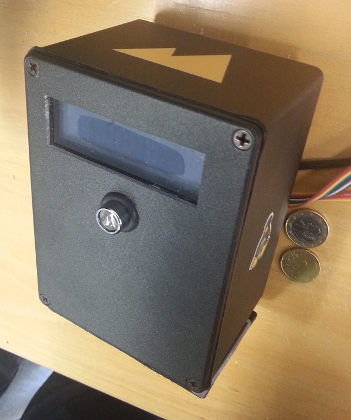

# emb-toveri
Weatherproof embedded user authenticator and authorizator device

## Skills needed to build a working Toveri

From front-end to backend

- [GNU gettext](https://www.gnu.org/software/gettext/)
- [Perl](https://www.perl.org/)
- [REST API](http://www.restapitutorial.com/)
- [HiPi](http://raspberrypi.znix.com/hipidocs/)
- [Swig](http://www.swig.org/papers/Perl98/swigperl.htm)
- [C](http://www.cprogramming.com/)
- [SPI](https://en.wikipedia.org/wiki/Serial_Peripheral_Interface_Bus)
- [Ansible](http://docs.ansible.com/)
- [Raspberry Pi](https://www.raspberrypi.org/)
- [Linux](https://www.linuxfoundation.org/)
- [KiCad](http://kicad-pcb.org/)
- [Blender](https://www.blender.org/)
- [Soldering](https://www.youtube.com/watch?v=vIT4ra6Mo0s)
- [Electronic assembly](https://duckduckgo.com/?q=genuino+starter+kit&t=canonical&ia=products)

## Estimated steps to production

* Ordering components from various suppliers (500-600€)
* Assembly of the PCB
* Soldering the PCB
* Making the cabling
* Disassembling and cleaning the 3D print
* Assembling the cables and components to the 3D-printed railing and enclosure.
* Installing Raspbian to the Raspberry Pi
* Setting up internet/network access
* Accessing device via remote maintenance connection
* Configuring barcode reader by reading control codes by hand.
* Installing software
* Configuring software and Server REST API
* Running hardware diagnostics
* Running software diagnostics
* Planning the deployment location
  - Proper accessible position
  - Network access
    - Toveri has a remote maintenance connection using ssh, typically this requires some firewall rules to allow inbound traffic to Toveri's port :TCP22
    - Toveri needs access to the Koha's REST API, typically at port :TCP443
    - Additionally a monitoring solution, such as Zabbix, needs extra inbound/outbound ports to be forwarded. This is outside the scope of this project.
  - Power utility access
  - Maximum distance between the exterior barcode reader and Raspberry Pi is 4m of cable.
  - Safe location for the Raspberry Pi in the interior space.
  - How to attach the device to the exterior wall?
* Executing the deployment plan
* Monitoring performance and logs
* Getting reports of device usage
* Maintenance

## Documentation

* Blender/README.md: Instructions on how to read the electronic enclosure and connection railing schematics.

* KiCad/README.md: Instructions on how to read the electronic diagrams.

* ASSEMBLY.md: Component manifest and supplier list.

* [more here](Documents/)

## Some pics about the finished Toveri

