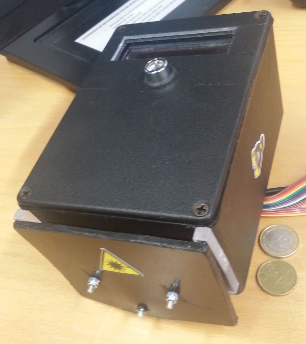

# emb-toveri
Weatherproof embedded user authenticator and authorizator device

# Documentation here:

* Blender/README.md: Instructions on how to read the electronic enclosure and connection railing schematics.

* KiCad/README.md: Instructions on how to read the electronic diagrams.

* ASSEMBLY.md: Component manifest and supplier list.

* barcodeReaderManualConfigurationCodes.png: Use these codes to set the initial state for the barcode readed, so it can be autoconfigured.

# Some pics about the finished Toveri

